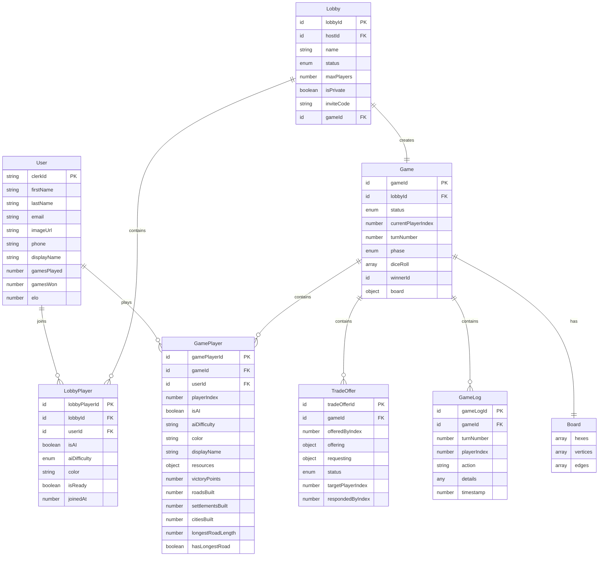

# Domain Model

## Core Entities & Relationships

## Entity Details

### User
Represents a registered player in the system.

**Key Attributes:**
- `clerkId`: Primary identifier from Clerk authentication
- `displayName`: Optional custom name for in-game display
- `gamesPlayed/gamesWon`: Statistics for ranking system
- `elo`: Skill rating for matchmaking (future feature)

**Relationships:**
- Can participate in multiple lobbies as `LobbyPlayer`
- Can play in multiple games as `GamePlayer`

### Lobby
Temporary waiting room before games start.

**Lifecycle States:**
- `waiting`: Open for players to join
- `starting`: Game initialization in progress
- `in_game`: Game has started, lobby locked
- `closed`: Game finished or cancelled

**Key Attributes:**
- `maxPlayers`: 2-4 players supported
- `isPrivate`: Whether invite code is required
- `inviteCode`: Optional 6-character code for private lobbies

### LobbyPlayer
Represents a player waiting in a lobby.

**Special Cases:**
- AI players have `userId = null` and `isAI = true`
- Human players must have `userId` and `isAI = false`
- `color` determines player color in game (red, blue, white, orange)

### Game
The main game entity containing all game state.

**Game Phases:**
- `setup_forward`: First placement round (clockwise)
- `setup_reverse`: Second placement round (counter-clockwise)
- `roll_dice`: Main turn start
- `robber_move`: Move robber when 7 is rolled
- `robber_steal`: Steal from adjacent player
- `discard`: Players with >7 cards discard half
- `trade_build`: Main action phase
- `game_over`: Game finished

**Board Structure:**
The board is embedded as a JSON object with:
- 19 hex tiles (resources + number tokens)
- 54 vertices (settlement/city positions)
- 72 edges (road positions)

### GamePlayer
In-game representation of a player.

**Resource Tracking:**
Each player tracks 5 resource types:
- `brick`, `lumber`, `ore`, `grain`, `wool`

**Victory Points:**
- Base: 1 VP per settlement, 2 VP per city
- Bonus: 2 VP for longest road
- Total: First to 10 VP wins

**Building Limits:**
- Roads: 15 maximum
- Settlements: 5 maximum
- Cities: 5 maximum (upgrade from settlements)

### TradeOffer
Represents a trade proposal between players.

**Trade Types:**
- Player-to-player: `targetPlayerIndex` specified
- Open trade: `targetPlayerIndex = null` (anyone can accept)
- Bank trade: 4:1 ratio (handled separately)

**Status Flow:**
`open` → `accepted`/`declined`/`cancelled`

### GameLog
Immutable log of all game actions.

**Purpose:**
- Game replay functionality
- Debugging and dispute resolution
- Analytics and player behavior analysis

## Data Flow Patterns

### Game Initialization
1. Lobby transitions to `starting` status
2. Game record created with generated board
3. GamePlayer records created for each lobby player
4. Initial setup phase begins

### Turn Progression
1. Current player takes actions
2. Game state updated via mutations
3. GameLog entry created for each action
4. Turn advances to next player
5. Real-time updates push to all clients

### Resource Distribution
1. Dice roll determines production numbers
2. Board hexes with matching numbers produce resources
3. Players with settlements/cities on those hexes gain resources
4. Desert hex produces nothing, robber moves if 7 rolled

### Building Validation
1. Player attempts to build structure
2. Server validates placement rules (adjacency, connectivity)
3. Resources deducted from player hand
4. Board updated with new structure
5. Victory points recalculated

## State Synchronization

### Convex Reactivity
- All queries automatically update when underlying data changes
- Components re-render only when relevant state changes
- Optimistic updates provide instant feedback

### Conflict Resolution
- Server-side validation prevents illegal moves
- Mutations are atomic - either fully succeed or fail
- Real-time subscriptions ensure consistent state across clients

### Performance Optimization
- Selective subscriptions reduce bandwidth
- Efficient queries with proper indexes
- Batch operations for resource distribution

## Extension Points

### Future Entities
- `Tournament`: Organized competitions
- `Guild`: Player groups/teams
- `Replay`: Saved game recordings
- `Achievement`: Player accomplishments

### Scalability Considerations
- Game sharding for large player bases
- AI computation offloading to dedicated servers
- Analytics pipeline for game insights
- Spectator mode for live game viewing
