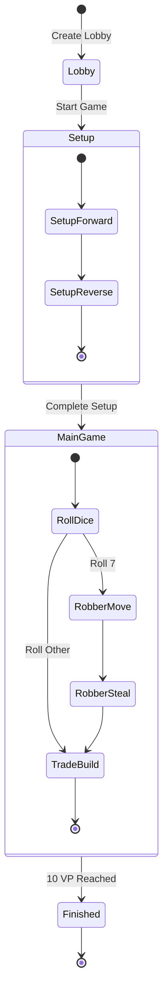
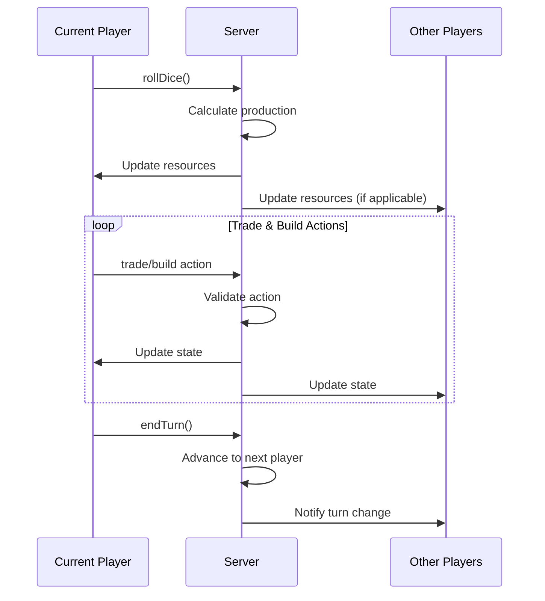
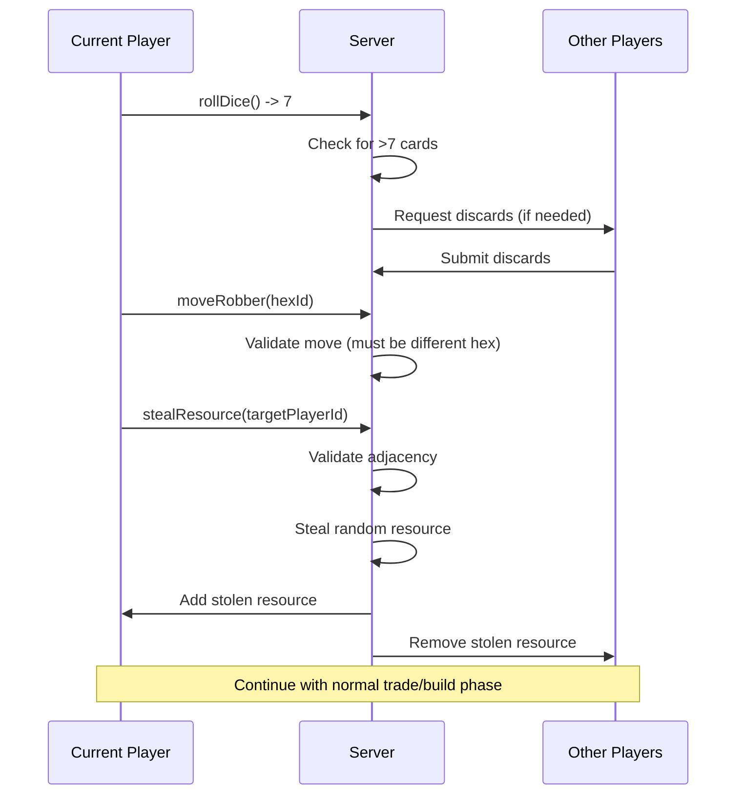

# Game Flow & State Machine

## Game Lifecycle



## Phase Definitions

### 1. Lobby Phase
**Purpose**: Gather players before game starts

**Valid Actions**:
- Create lobby (host only)
- Join lobby (any authenticated user)
- Add AI players (host only)
- Leave lobby (any player)
- Start game (host only, when all ready)

**Transition Rules**:
- Minimum 2 players required to start
- All human players must be ready
- Maximum 4 players (human + AI)

### 2. Setup Phase
**Purpose**: Initial settlement and road placement

#### Setup Forward (Round 1)
- **Order**: Clockwise starting with host
- **Actions**: Place 1 settlement + 1 road
- **Rules**: 
  - Settlement must be on empty vertex
  - Road must connect to settlement
  - No adjacency to existing settlements
- **Resources**: No resources gained

#### Setup Reverse (Round 2)
- **Order**: Counter-clockwise (reverse of round 1)
- **Actions**: Place 1 settlement + 1 road
- **Rules**: Same as round 1
- **Resources**: Gain resources from adjacent hexes

### 3. Main Game Loop
**Purpose**: Core gameplay with dice, resources, trading, building

#### Roll Dice Phase
- **Trigger**: Start of each turn
- **Actions**: Roll 2 dice (1-6 each)
- **Outcomes**:
  - **Total 7**: Trigger robber sequence
  - **Other (2-6, 8-12)**: Resource production

#### Resource Production
- **Rule**: Each hex with matching number produces 1 resource per building
- **Settlement**: 1 resource
- **City**: 2 resources
- **Desert**: Never produces
- **Robber**: Blocks production on its hex

#### Robber Sequence (When 7 is rolled)
1. **Discard Phase**: Players with >7 cards discard half (round down)
2. **Move Robber**: Current player moves robber to new hex
3. **Steal Phase**: Current player steals 1 random resource from adjacent player

#### Trade & Build Phase
- **Duration**: Until player ends turn
- **Available Actions**:
  - Trade with other players
  - Trade with bank (4:1 ratio)
  - Build road (1 brick + 1 lumber)
  - Build settlement (1 brick + 1 lumber + 1 grain + 1 wool)
  - Build city (2 grain + 3 ore)
  - Play development card (future feature)
  - End turn

### 4. Game Over Phase
**Trigger**: Any player reaches 10 victory points

**Victory Point Sources**:
- Settlement: 1 VP each
- City: 2 VP each
- Longest Road: 2 VP (if held)
- Largest Army: 2 VP (future feature)
- Development Cards: 1 VP each (future feature)

## Turn Sequence Detail

### Normal Turn (Non-7 Roll)



### Robber Turn (Roll 7)



## State Validation Rules

### Setup Phase Validation
```typescript
const validateSetupPlacement = (
  board: Board,
  vertexId: number,
  edgeId: number,
  playerIndex: number
) => {
  // Vertex must be empty
  const vertex = board.vertices.find(v => v.id === vertexId);
  if (vertex.building) return false;
  
  // No adjacent settlements
  const adjacentVertices = vertex.adjacentVertices;
  for (const adjId of adjacentVertices) {
    const adjVertex = board.vertices.find(v => v.id === adjId);
    if (adjVertex.building) return false;
  }
  
  // Edge must connect to vertex
  const edge = board.edges.find(e => e.id === edgeId);
  if (!edge.vertices.includes(vertexId)) return false;
  
  // Edge must be empty
  if (edge.hasRoad) return false;
  
  return true;
};
```

### Building Validation
```typescript
const validateRoadPlacement = (
  board: Board,
  edgeId: number,
  playerIndex: number
) => {
  const edge = board.edges.find(e => e.id === edgeId);
  
  // Edge must be empty
  if (edge.hasRoad) return false;
  
  // Must connect to player's existing road or settlement
  const [v1Id, v2Id] = edge.vertices;
  const v1 = board.vertices.find(v => v.id === v1Id);
  const v2 = board.vertices.find(v => v.id === v2Id);
  
  const hasPlayerSettlement = 
    (v1.building && v1.ownerId === playerIndex) ||
    (v2.building && v2.ownerId === playerIndex);
  
  const hasAdjacentRoad = 
    board.edges.some(e => 
      e.hasRoad && 
      e.ownerId === playerIndex &&
      (e.vertices.includes(v1Id) || e.vertices.includes(v2Id))
    );
  
  return hasPlayerSettlement || hasAdjacentRoad;
};
```

### Trade Validation
```typescript
const validateTradeOffer = (
  offering: Resources,
  requesting: Resources,
  playerResources: Resources
) => {
  // Must have resources to offer
  for (const [resource, amount] of Object.entries(offering)) {
    if (playerResources[resource] < amount) return false;
  }
  
  // Must offer at least one resource
  const totalOffered = Object.values(offering).reduce((a, b) => a + b, 0);
  if (totalOffered === 0) return false;
  
  // Must request at least one resource
  const totalRequested = Object.values(requesting).reduce((a, b) => a + b, 0);
  if (totalRequested === 0) return false;
  
  return true;
};
```

## Error Handling

### Client-Side Validation
- Pre-validate actions before sending to server
- Provide immediate feedback for invalid actions
- Show resource costs and requirements

### Server-Side Validation
- Final authority on all game rules
- Atomic transactions to prevent partial state updates
- Detailed error messages for debugging

### Synchronization Issues
- Handle connection drops gracefully
- Re-sync state on reconnection
- Conflict resolution for concurrent actions

## Performance Considerations

### Turn Timer
- Implement optional turn timer (default 60 seconds)
- Auto-end turn after timeout
- Visual warnings for low time

### Batch Operations
- Resource distribution for multiple players
- Multiple building actions in single turn
- Bulk updates for AI turns

### Real-time Updates
- Push updates immediately after each action
- Optimize subscription queries
- Handle rapid actions (dice animations)

## Testing Strategy

### Unit Tests
- Individual validation functions
- Resource calculation logic
- Board generation algorithms

### Integration Tests
- Complete turn sequences
- Multi-player scenarios
- Edge cases (robber, discarding)

### Load Tests
- Concurrent game sessions
- AI player performance
- Real-time subscription limits
